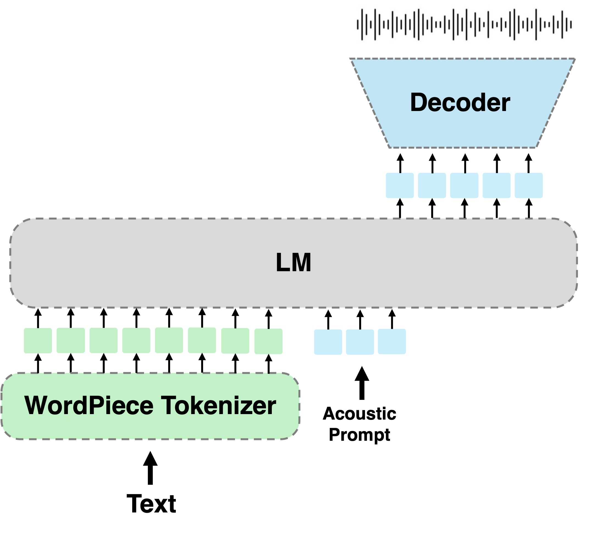

# A Language Modeling Approach to Diacritic-Free Hebrew TTS (Interspeech 2024)

Inference code and model weights for the paper "A Language Modeling Approach to Diacritic-Free Hebrew TTS" (Interspeech
2024).

<p align="center">
<a href='https://arxiv.org/abs/2407.12206'></a>
   <a href='https://pages.cs.huji.ac.il/adiyoss-lab/HebTTS/'></a> 
   <a href='https://colab.research.google.com/drive/1f3-6Dqbna9_hI5C9V4qTIG05dixW-r72?usp=sharing'></a> 
   <a href='https://github.com/slp-rl/HebTTS'></a> 

</p>



___
**Abstract:** We tackle the task of text-to-speech (TTS) in Hebrew. Traditional Hebrew contains Diacritics (`Niqqud'),
 which dictate the way individuals should pronounce given words, however, modern Hebrew rarely uses them. The lack of
 diacritics in modern Hebrew results in readers expected to conclude the correct pronunciation and understand which
 phonemes to use based on the context. This imposes a fundamental challenge on TTS systems to accurately map between
 text-to-speech. In this study, we propose to adopt a language modeling Diacritics-Free TTS approach, for the task of
 Hebrew TTS. The language model (LM) operates on discrete speech representations and is conditioned on a word-piece
 tokenizer. We optimize the proposed method using in-the-wild weakly supervised recordings and compare it to several
 diacritic based Hebrew TTS systems. Results suggest the proposed method is superior to the evaluated baselines
 considering both content preservation and naturalness of the generated speech.

## Try it out!
You can try our model in the [google colab](https://colab.research.google.com/drive/1f3-6Dqbna9_hI5C9V4qTIG05dixW-r72?usp=sharing) demo.
## Installation


```bash
git clone https://github.com/slp-rl/HebTTS.git
```

We publish our checkpoint
in [google drive](https://drive.google.com/file/d/11NoOJzMLRX9q1C_Q4sX0w2b9miiDjGrv/view?usp=share_link).
AR model trained for 1.2M steps and NAR model for 200K steps on [HebDB](https://pages.cs.huji.ac.il/adiyoss-lab/HebDB/).

```bash
gdown 11NoOJzMLRX9q1C_Q4sX0w2b9miiDjGrv
```
### Install Dependencies

```bash
pip install torch torchaudio
pip install torchmetrics
pip install omegaconf
pip install git+https://github.com/lhotse-speech/lhotse
pip install librosa
pip install encodec
pip install phonemizer
pip install audiocraft  # optional
```

## Inference

You can play with the model with different speakers and text prompts.

run `infer.py`:

```
python infer.py  --checkpoint checkpoint.pt --output-dir ./out --text "היי מה קורה"
```

you can specify additional arguments
`--speaker` and `--top-k`.

### Multi Band Diffusion

> [!TIP] 
> We allow using the new Multi Band Diffusion (MBD) vocoder for generating a better quallity audio.
Install audiocraft and set `--mbd True` flag.


### Text

you can concatenate text prompts using `|` or specify a path of a text file spereated by `\n` if writing Hebrew in
terminal is inconvenient.

```text
תגידו גנבו לכם פעם את האוטו ופשוט ידעתם שאין טעם להגיש תלונה במשטרה
היי מה קורה
בראשית היתה חללית מסוג נחתת
```

and run

```
python infer.py  --checkpoint checkpoint.pt --output-dir ./out --text example.txt
```

### Speakers

you can use the speaker defined in `speakers.yaml`, or add additional speakers.
specify wav files and transcription in same format.

```
--speaker shaul
```

## Citation

```bibtex
@misc{roth2024languagemodelingapproachdiacriticfree,
   title={A Language Modeling Approach to Diacritic-Free Hebrew TTS}, 
   author={Amit Roth and Arnon Turetzky and Yossi Adi},
   year={2024},
   eprint={2407.12206},
   archivePrefix={arXiv},
   primaryClass={cs.CL},
   url={https://arxiv.org/abs/2407.12206}, 
}
```

## Acknowledgments
- Model code inside `valle` is based on the implementation of [Feiteng Li](https://github.com/lifeiteng/vall-e).
